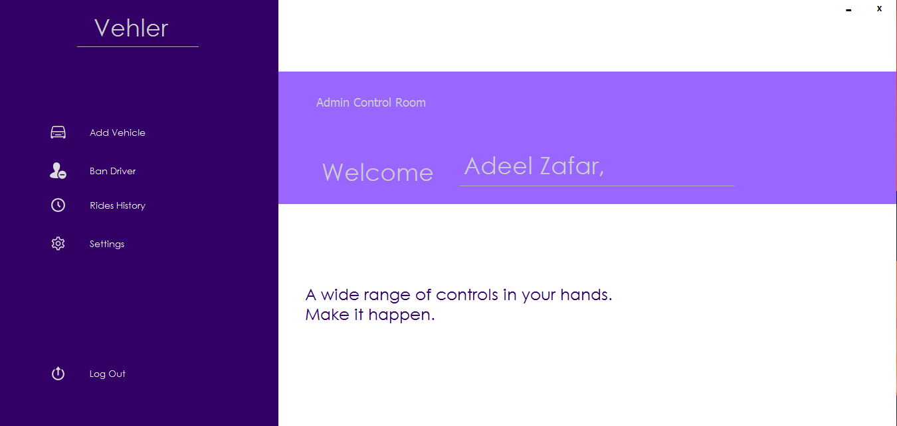

# Vehler
Vehler is a Vehicle Management System built in Java using Microsoft Access as the backend database and SQL for queries.

The aim of this project was to develop an offline application that could manage vehicles, drivers as well as the passengers could book the rides.

## Modules:

There are mainly 5 modules in this project.
#### Vehicle Management
Admin can add new vehicles, and manage them.
#### Driver Management
A new driver can sign up, pick up the kind of vehicle he drives and he'll be alloted a vehicle according to his selection. He can then turn his status as online and start picking rides.
#### Passenger Management
New passengers can sign up and login into the system to book rides. They can book a ride, check their current rides and also past rides.
#### Rides Management
Admin can manage the rides going on. An admin can even ban a driver.
#### Booking Ride
Ride booking is done by the passengers where they can choose from 3 types of vehicles i.e. Bus, Rickshaw and Car. They have to select the routes and begin the travelling.

## How to set up Project

It's very simple. This project is developed using NetBeans. 
* Install Netbeans
* Import this project 
* Add the libraries that are given in the Libraries Folder.
* Admin account username: adeel619
  Admin account password : 9901

## Screenshots

